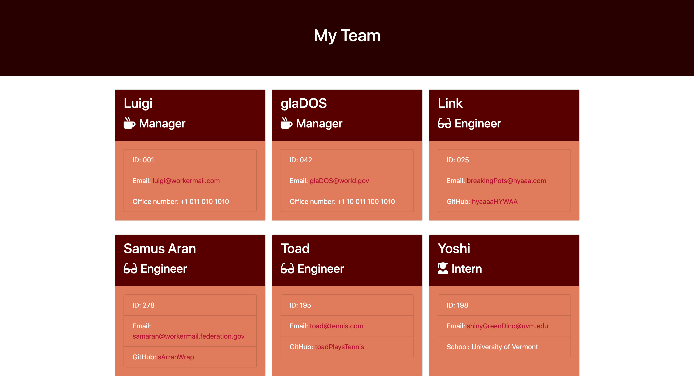
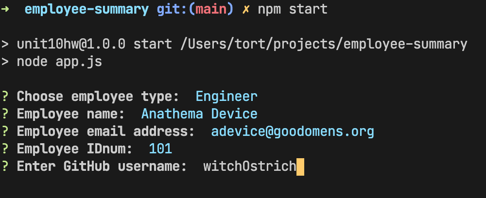

# Go Team

## Description

This application accepts command line input and generates a good-looking html file to show off your employee roster. It makes use of the inquirer package.

## Installation

To install, clone this repo to your machine and open a terminal at its directory. To install the required dependencies, run `npm install`.

## Usage

After installing, run the application by opening a termainal at the application's directory and running `npm start`. Follow the prompts. Once finished entering employee details, an html file will be produced in the `output` folder.

Example of the html file:

Command Line Interface:

## License

### MIT License 

Copyright (c) 2020 Matt Torcellini

Permission is hereby granted, free of charge, to any person obtaining a copy
of this software and associated documentation files (the "Software"), to deal
in the Software without restriction, including without limitation the rights
to use, copy, modify, merge, publish, distribute, sublicense, and/or sell
copies of the Software, and to permit persons to whom the Software is
furnished to do so, subject to the following conditions:

The above copyright notice and this permission notice shall be included in all
copies or substantial portions of the Software.

THE SOFTWARE IS PROVIDED "AS IS", WITHOUT WARRANTY OF ANY KIND, EXPRESS OR
IMPLIED, INCLUDING BUT NOT LIMITED TO THE WARRANTIES OF MERCHANTABILITY,
FITNESS FOR A PARTICULAR PURPOSE AND NONINFRINGEMENT. IN NO EVENT SHALL THE
AUTHORS OR COPYRIGHT HOLDERS BE LIABLE FOR ANY CLAIM, DAMAGES OR OTHER
LIABILITY, WHETHER IN AN ACTION OF CONTRACT, TORT OR OTHERWISE, ARISING FROM,
OUT OF OR IN CONNECTION WITH THE SOFTWARE OR THE USE OR OTHER DEALINGS IN THE
SOFTWARE.